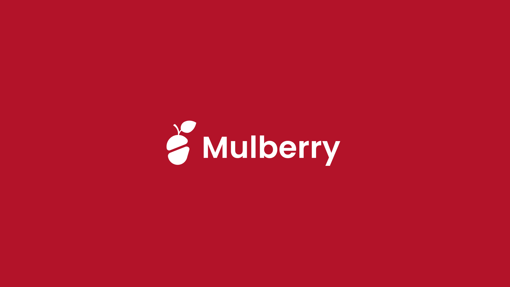
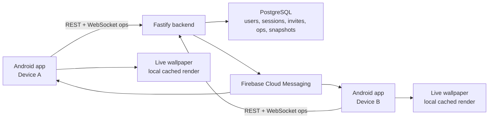

# Mulberry


Mulberry is a paired-device Android app for two people who share a persistent drawing canvas, with a Next.js landing site in the same Turborepo workspace. The foreground app is where users draw, pair, and manage settings; the lock screen shows the latest local canvas snapshot through an Android live wallpaper.

The product is built for ambient connection, not group collaboration. Active devices synchronize quickly over WebSocket, while sleeping or backgrounded devices converge later through push-triggered recovery and revision reconciliation.

## Contents

- [Features](#features)
- [Architecture](#architecture)
- [Repository layout](#repository-layout)
- [Prerequisites](#prerequisites)
- [Getting started](#getting-started)
- [Configuration](#configuration)
- [Development commands](#development-commands)
- [API overview](#api-overview)
- [Testing](#testing)
- [Troubleshooting](#troubleshooting)

## Features

- Pair exactly two Android users into a private shared session.
- Authenticate with Google and maintain local session bootstrap state.
- Generate and redeem short invite codes for pairing.
- Draw freehand strokes with color and width controls.
- Synchronize canvas operations with server-assigned revisions.
- Render the shared canvas locally for immediate feedback.
- Display the latest cached canvas state through a live wallpaper.
- Recover missed operations after process death, network loss, or idle periods.
- Register Firebase Cloud Messaging tokens for background canvas catch-up.

## Architecture



The backend owns authentication, pairing, operation ordering, replay, and snapshots. Android owns touch capture, optimistic rendering, local Room/DataStore persistence, wallpaper rendering, and opportunistic recovery.

> [!IMPORTANT]
> The lock screen is display-only. Android does not allow this app to provide reliable interactive drawing from the lock screen or unrestricted background networking while the device is asleep.

## Repository layout

```text
.
├── apps
│   ├── backend              # Fastify + TypeScript API, WebSocket sync, Postgres migrations
│   ├── mobile               # Android app built with Kotlin, Compose, Hilt, Room, WorkManager
│   └── web                  # Next.js landing site with ShadCN/Tailwind styling
├── docs
│   ├── product-prd.pdf      # Product requirements and platform constraints
│   └── implementation-plan.pdf
├── lib
│   └── banner.png           # README banner
├── scripts
│   └── reset-local-onboarding.sh
├── pnpm-workspace.yaml      # PNPM workspace package map
├── turbo.json               # Turborepo task pipeline
├── docker-compose.yml       # Local Postgres + backend
└── .env.example
```

## Prerequisites

- Docker Desktop or another Docker Compose runtime
- Node.js 22+ and PNPM 10+ for monorepo development outside Docker
- Android Studio or Android SDK command-line tools
- JDK 17 or a compatible Android Gradle Plugin runtime
- A Firebase project if you want real FCM behavior
- A Google OAuth server client ID for real Google Sign-In

## Getting started

Clone the repository, then create a local environment file:

```bash
cp .env.example .env
```

Start the local backend and database from the repository root:

```bash
docker compose up --build
```

The compose stack starts:

- PostgreSQL on `localhost:5432`
- Backend API on `localhost:8080`

Check the backend:

```bash
curl http://localhost:8080/health
```

Run the Android dev build from `apps/mobile`:

```bash
./gradlew :app:installDevDebug
```

The `devDebug` variant points at `http://10.0.2.2:8080/`, so an Android emulator can reach the Dockerized backend without additional network configuration.

## Configuration

### Backend

The backend reads configuration from environment variables:

| Variable | Required | Description |
| --- | --- | --- |
| `PORT` | No | API port. Defaults to `8080`. |
| `DATABASE_URL` | No | PostgreSQL connection string. Docker Compose sets this automatically. |
| `ALLOW_DEV_GOOGLE_TOKENS` | No | Allows development Google tokens when `true`. Defaults to `false` when `NODE_ENV=production`; local Compose enables it. |
| `GOOGLE_SERVER_CLIENT_ID` | For real auth | OAuth server client ID used to verify Google ID tokens. |
| `FIREBASE_SERVICE_ACCOUNT_PATH` | For FCM | Path to a Firebase service account JSON file. |
| `FIREBASE_SERVICE_ACCOUNT_JSON` | For FCM | Inline Firebase service account JSON. |

For real Google Sign-In, update `.env`:

```text
GOOGLE_SERVER_CLIENT_ID=your-google-oauth-server-client-id
```

For Firebase Cloud Messaging, provide either `FIREBASE_SERVICE_ACCOUNT_PATH` or `FIREBASE_SERVICE_ACCOUNT_JSON`. Without Firebase credentials, the backend uses a no-op sender so local foreground sync still works.

### Android

The Android app has two product flavors:

| Flavor | API base URL | Debug menu |
| --- | --- | --- |
| `dev` | `http://10.0.2.2:8080/` | Enabled |
| `prod` | `PROD_API_BASE_URL`, default `https://api.mulberry.my/` | Disabled |

`GOOGLE_SERVER_CLIENT_ID` and `PROD_API_BASE_URL` can be provided through `apps/mobile/local.properties` or the shell environment:

```properties
GOOGLE_SERVER_CLIENT_ID=your-google-oauth-server-client-id
PROD_API_BASE_URL=https://your-production-api.example/
```

If you are building from a clean checkout, add the Firebase client config expected by each flavor you build:

```text
apps/mobile/app/src/dev/google-services.json
apps/mobile/app/src/prod/google-services.json
```

## Development commands

Install JavaScript workspace dependencies from the repository root:

```bash
pnpm install
```

Run all Turborepo build tasks:

```bash
pnpm build
```

### Backend

```bash
pnpm --filter @mulberry/backend dev
```

Useful backend commands:

```bash
pnpm --filter @mulberry/backend build
pnpm --filter @mulberry/backend test
```

Railway still builds the backend through the root `Dockerfile`. The Docker image uses the root PNPM workspace lockfile and builds only `@mulberry/backend`, so the backend deployment path stays independent from the web and Android apps.

### Web

```bash
pnpm --filter @mulberry/web dev
```

Useful web commands:

```bash
pnpm --filter @mulberry/web build
pnpm --filter @mulberry/web typecheck
```

### Android

```bash
pnpm --filter @mulberry/mobile build
pnpm --filter @mulberry/mobile install:dev
pnpm --filter @mulberry/mobile test
```

From the repository root, reset the local Docker database:

```bash
docker compose down -v
docker compose up --build
```

From the repository root, reset local Android onboarding state and the Docker database:

```bash
./scripts/reset-local-onboarding.sh
```

## API overview

The backend exposes a small REST API plus one WebSocket endpoint:

| Area | Endpoints |
| --- | --- |
| Auth | `POST /auth/google`, `POST /auth/refresh`, `POST /auth/logout` |
| Devices | `POST /devices/fcm-token`, `DELETE /devices/fcm-token` |
| Bootstrap | `GET /bootstrap` |
| Profile | `PUT /me/profile` |
| Pairing | `POST /invites`, `POST /invites/redeem`, `POST /invites/:inviteId/accept`, `POST /invites/:inviteId/decline` |
| Canvas | `GET /canvas/ops`, `GET /canvas/snapshot`, `GET /canvas/sync` |
| Health | `GET /health` |

Canvas operations are stored as an ordered log. The server assigns authoritative revisions, clients apply operations in revision order, and recovery starts from the last applied revision.

## Testing

Run backend tests:

```bash
pnpm --filter @mulberry/backend test
```

Run Android unit tests:

```bash
pnpm --filter @mulberry/mobile test
```

The current test coverage includes route handling, app bootstrap resolution, feature flags, drawing stroke behavior, wallpaper placement/status logic, sync JSON parsing, and recovery policy behavior.

## Troubleshooting

### The emulator cannot reach the backend

Use the `devDebug` flavor. It is configured for `http://10.0.2.2:8080/`, which maps the Android emulator back to the host machine.

### Google Sign-In fails locally

Confirm that the same `GOOGLE_SERVER_CLIENT_ID` is available to both the backend and Android build. For quick local backend development, `ALLOW_DEV_GOOGLE_TOKENS=true` is already set in `docker-compose.yml`.

### Background updates are delayed

This is expected under Android Doze, app standby, and OEM battery policies. Active foreground sessions use WebSocket sync; idle devices catch up through FCM and recovery when Android grants execution time.

### The local database needs a clean slate

```bash
docker compose down -v
docker compose up --build
```
